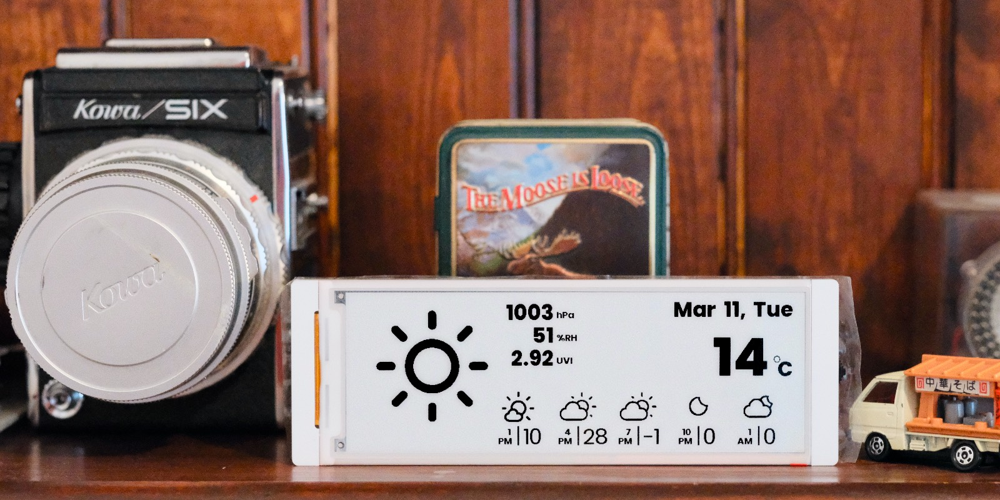

# weather-crow5.7
Weather station using [CrowPanel ESP32 E-Paper HMI 5.79-inch Display](https://www.elecrow.com/crowpanel-esp32-5-79-e-paper-hmi-display-with-272-792-resolution-black-white-color-driven-by-spi-interface.html)

This code based on the CrowPanel ESP32 E-Paper HMI 5.79-inch Display [example](https://www.elecrow.com/wiki/CrowPanel_ESP32_E-paper_5.79-inch_HMI_Display.html). I've added and modified the code to display custom weather icons and font rendering.
It is a weather station that displays the current weather and forecast for the next 5 to 25 hours depending on the configuration.
The weather data is fetched from the [OpenWeatherMap](https://openweathermap.org/) API.

---

## 🚀 Quick Start (Recommended for Beginners)

**No coding required!** Flash the firmware directly from your browser:

### [👉 Install Weather Crow via Web Installer](https://kotamorishi.github.io/weather-crow5.7/)

**Requirements:**
- Chrome, Edge, or Opera browser
- USB cable connected to your ESP32-S3

**After flashing:**
1. Device creates WiFi hotspot: **WeatherCrow-Config**
2. Connect to it on your phone/computer
3. Go to **192.168.4.1**
4. Enter your WiFi credentials and [OpenWeatherMap API key](https://openweathermap.org/api)

---

## What You Need
- Hardware: [CrowPanel ESP32 E-Paper HMI 5.79-inch Display](https://www.elecrow.com/crowpanel-esp32-5-79-e-paper-hmi-display-with-272-792-resolution-black-white-color-driven-by-spi-interface.html)
- API Key: [OpenWeatherMap API key](https://openweathermap.org/) (free tier works!)

---

## Developer Setup (Build from Source)

If you want to modify the code or build from source:

1. **Install PlatformIO**
   - Install via [VS Code extension](https://platformio.org/install/ide?install=vscode) (recommended), or
   - Install via Homebrew: `brew install platformio`, or
   - Install via pip: `pip install platformio`

2. **Clone the repository**
   ```bash
   git clone https://github.com/kotamorishi/weather-crow5.7.git
   cd weather-crow5.7
   ```

3. **Build the project**
   ```bash
   pio run
   ```

4. **Upload to device**
   ```bash
   pio run --target upload
   ```

5. **Monitor serial output** (optional)
   ```bash
   pio device monitor
   ```

## Useful Commands

| Command | Description |
|---------|-------------|
| `pio run` | Build the project |
| `pio run --target upload` | Build and upload to device |
| `pio run --target clean` | Clean build artifacts |
| `pio device monitor` | Open serial monitor (115200 baud) |

---

# Credits
- Weather data:
  - Weather data provided by [OpenWeather](https://openweathermap.org/)

- Icons:
  - [Weather Icons](https://erikflowers.github.io/weather-icons/)
  Weather Icons licensed under SIL OFL 1.1
  The Weather Icons project created and maintained by Erik Flowers. v1.0 artwork by Lukas Bischoff. v1.1 - 2.0 artwork by Erik Flowers

- 8px font:
Copyright (c) YUJI OSHIMOTO.
  - [04b-03](http://www.04.jp.org/)

- Poppins:
This project uses the "Poppins" font, licensed under the SIL Open Font License, Version 1.1.
Copyright (c) Indian Type Foundry.
  - [Poppins](https://fonts.google.com/specimen/Poppins)
  - [Poppins License](https://fonts.google.com/specimen/Poppins/license)
