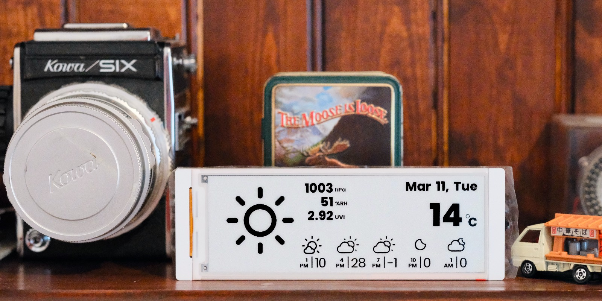

# weather-crow5.7
Weather station using [CrowPanel ESP32 E-Paper HMI 5.79-inch Display](https://www.elecrow.com/crowpanel-esp32-5-79-e-paper-hmi-display-with-272-792-resolution-black-white-color-driven-by-spi-interface.html)

This code based on the CrowPanel ESP32 E-Paper HMI 5.79-inch Display [example](https://www.elecrow.com/wiki/CrowPanel_ESP32_E-paper_5.79-inch_HMI_Display.html). I've added and modified the code to display custom weather icons and font rendering.
It is a weather station that displays the current weather and forecast for the next 5 to 25 hours depending on the configuration.
The weather data is fetched from the [OpenWeatherMap](https://openweathermap.org/) API.

# What you need
- Hardware : [CrowPanel ESP32 E-Paper HMI 5.79-inch Display](https://www.elecrow.com/crowpanel-esp32-5-79-e-paper-hmi-display-with-272-792-resolution-black-white-color-driven-by-spi-interface.html)
- API Key : [OpenWeatherMap API key](https://openweathermap.org/)
- Software : [Arduino IDE > 2.3.4](https://www.arduino.cc/en/software)

# Setup the environment
1. Install the ESP32 board in Arduino IDE
   - Open Arduino IDE
   - Go to File > Preferences
   - In the Additional Boards Manager URLs field, add the following URL:
     ```
     https://dl.espressif.com/dl/package_esp32_index.json
     ```
   - Click OK
   - Go to Tools > Board > Boards Manager
   - Search for `esp32` and install the board

2. Install the required libraries
    - Open Arduino IDE
    - Go to Sketch > Include Library > Manage Libraries
    - Search for and install the following libraries:
      - Arduino_Json

3. Download the code
    - Clone this repo or download the code as a zip file
    - Open the `weather-crow5.7.ino` file in Arduino IDE

4. Configure the settings
    - Copy `config.example.h` to `config.h` and update the defined values.

5. Configure the build settings
    - Go to Tools > Board and select `ESP32 S3 Dev Module`
    - Go to Tools > Partition Scheme and select `Huge APP (3MB No OTA/1MB SPIFFS)`
    - Go to Tools > PSRAM and select `OPI PSRAM`
    - Go to Tools > Port and select the port where the CrowPanel ESP32 E-Paper HMI 5.79-inch Display is connected

5. Upload the code
    - Set the `baud rate to 115200` in the serial monitor.
    - Connect the CrowPanel ESP32 E-Paper HMI 5.79-inch Display to your computer
    - Click the Upload button


# Credits
- Icons:
  - [Weather Icons](https://erikflowers.github.io/weather-icons/)
  Weather Icons licensed under SIL OFL 1.1
  The Weather Icons project created and maintained by Erik Flowers. v1.0 artwork by Lukas Bischoff. v1.1 - 2.0 artwork by Erik Flowers


- 8px font:
Copyright (c) YUJI OSHIMOTO.
  - [04b-03](http://www.04.jp.org/)

- Poppins:
This project uses the "Poppins" font, licensed under the SIL Open Font License, Version 1.1.
Copyright (c) Indian Type Foundry.
  - [Poppins](https://fonts.google.com/specimen/Poppins)
  - [Poppins License](https://fonts.google.com/specimen/Poppins/license)
